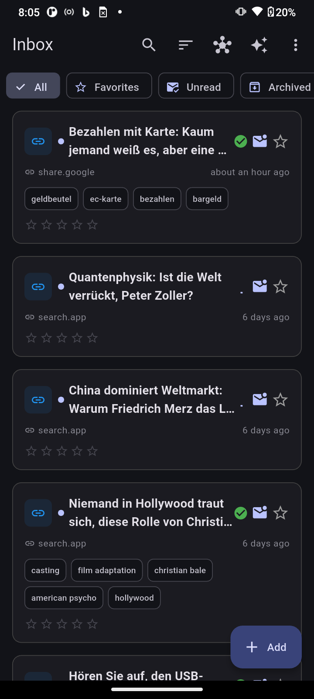
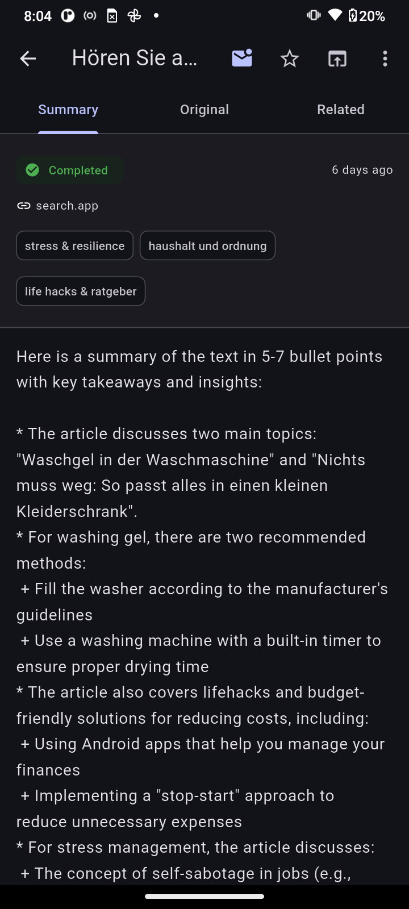
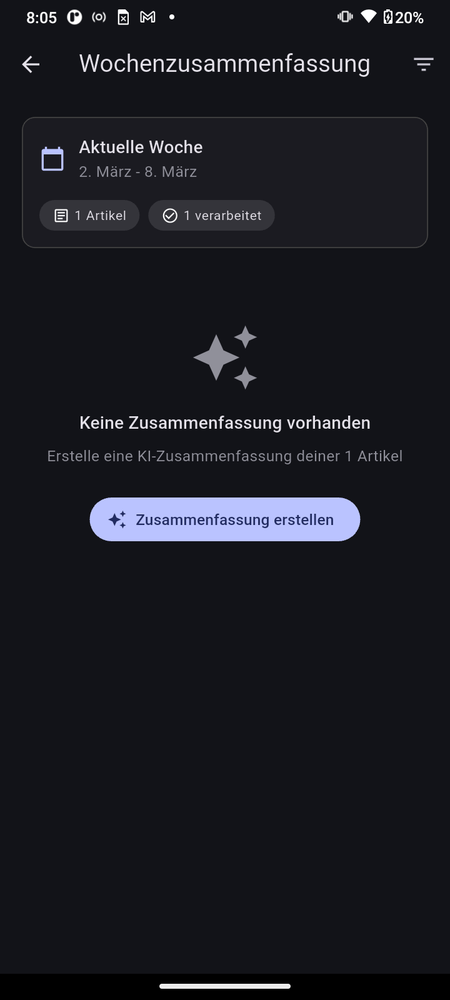
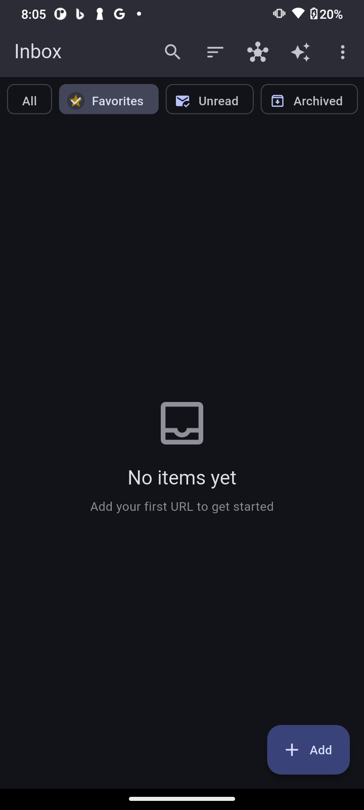

# VibedInsight

A self-hosted personal knowledge platform for collecting, analyzing, and summarizing web content with AI.

Think of it as a self-hosted alternative to Raindrop.io + Readwise, with local AI processing via Ollama.

## Screenshots

<p align="center">
  
  &nbsp;
  
  &nbsp;
  
  &nbsp;
  
</p>
<p align="center">
  <em>Inbox &nbsp;&nbsp;&nbsp;&nbsp;&nbsp;&nbsp;&nbsp;&nbsp;&nbsp;&nbsp;&nbsp;&nbsp;&nbsp;&nbsp; Article Detail &nbsp;&nbsp;&nbsp;&nbsp;&nbsp;&nbsp;&nbsp;&nbsp; Weekly Summary &nbsp;&nbsp;&nbsp;&nbsp; Filter & Search</em>
</p>

## Features

- **Collect** - Save links, articles, and notes from anywhere via URL or Android Share Sheet
- **Summarize** - AI-generated summaries using local LLM (Ollama/llama3.2)
- **Organize** - Automatic topic extraction and categorization
- **Weekly Digest** - AI-generated weekly summary with key insights across all saved articles
- **Rate** - 1–5 star rating for items
- **Export** - Obsidian-compatible Markdown ZIP export
- **Knowledge Graph** - Automatic relation detection between articles via shared topics
- **Privacy** - Self-hosted, your data stays on your server, no tracking

## Architecture

```
┌─────────────────┐     ┌─────────────────┐     ┌─────────────────┐
│  Flutter App    │────▶│  FastAPI        │────▶│  PostgreSQL     │
│  (Android/iOS)  │     │  Backend        │     │  Database       │
└─────────────────┘     └────────┬────────┘     └─────────────────┘
                                 │
                                 ▼
                        ┌─────────────────┐
                        │  Ollama         │
                        │  (llama3.2)     │
                        └─────────────────┘
```

## Quick Start

### Prerequisites

- VPS with Docker & Docker Compose
- Existing Traefik + Ollama setup (or standalone deployment)
- Android device for the mobile app

### Backend Deployment

```bash
# Clone repository
cd /srv
git clone https://github.com/sprobst76/VibedInsight.git vibedinsight
cd vibedinsight/backend

# Configure
cp .env.example .env
nano .env  # Set DOMAIN and POSTGRES_PASSWORD

# Deploy
docker compose up -d

# Verify
curl https://insight.lab.YOUR_DOMAIN/health
```

See [backend/DEPLOY.md](backend/DEPLOY.md) for detailed instructions.

### Mobile App

Download the latest APK from [Releases](https://github.com/sprobst76/VibedInsight/releases) and install on your Android device.

Or build from source:

```bash
cd app
flutter pub get
flutter build apk --release
```

## Configuration

### Backend Environment Variables

| Variable | Description | Default |
|----------|-------------|---------|
| `DOMAIN` | Your domain (for Traefik) | - |
| `POSTGRES_PASSWORD` | Database password | - |
| `OLLAMA_MODEL` | Ollama model to use | `llama3.2` |
| `TZ` | Timezone | `Europe/Berlin` |

### App Configuration

Edit `app/lib/config/api_config.dart` to set your backend URL:

```dart
static const String productionUrl = 'https://insight.lab.YOUR_DOMAIN';
```

## API Endpoints

| Method | Endpoint | Description |
|--------|----------|-------------|
| `GET` | `/health` | Health check |
| `GET` | `/items` | List items (filter, search, paginate) |
| `GET` | `/items/{id}` | Get item details |
| `DELETE` | `/items/{id}` | Delete item |
| `POST` | `/items/{id}/rating` | Set 1–5 star rating |
| `POST` | `/ingest/url` | Ingest from URL |
| `POST` | `/ingest/text` | Ingest raw text |
| `GET` | `/topics` | List all topics |
| `GET` | `/weekly` | List weekly summaries |
| `POST` | `/weekly/generate` | Generate weekly AI summary |
| `GET` | `/export/markdown` | Download Markdown ZIP |
| `GET` | `/items/graph/data` | Knowledge graph data |

Full API documentation at `/docs` (Swagger UI).

## Tech Stack

### Backend
- Python 3.12
- FastAPI
- SQLAlchemy 2.0 (async)
- PostgreSQL 16
- Ollama (llama3.2)
- trafilatura (web scraping)

### Mobile
- Flutter 3.x
- Dart 3.x
- Riverpod (state management)
- Dio (HTTP client)
- go_router (navigation)

### Infrastructure
- Docker & Docker Compose
- Traefik (reverse proxy)
- GitHub Actions (CI/CD)

## Development

### Backend

```bash
cd backend
python -m venv .venv
source .venv/bin/activate
pip install -e ".[dev]"

# Run locally
uvicorn app.main:app --reload --port 8000
```

### Flutter App

```bash
cd app
flutter pub get
flutter run
```

## Contributing

1. Fork the repository
2. Create a feature branch (`git checkout -b feature/amazing-feature`)
3. Commit your changes (`git commit -m 'Add amazing feature'`)
4. Push to the branch (`git push origin feature/amazing-feature`)
5. Open a Pull Request

## License

This project is licensed under the MIT License - see the [LICENSE](LICENSE) file for details.

## Acknowledgments

- [Ollama](https://ollama.ai/) - Local LLM runtime
- [trafilatura](https://trafilatura.readthedocs.io/) - Web content extraction
- [FastAPI](https://fastapi.tiangolo.com/) - Modern Python web framework
- [Flutter](https://flutter.dev/) - Cross-platform UI toolkit
